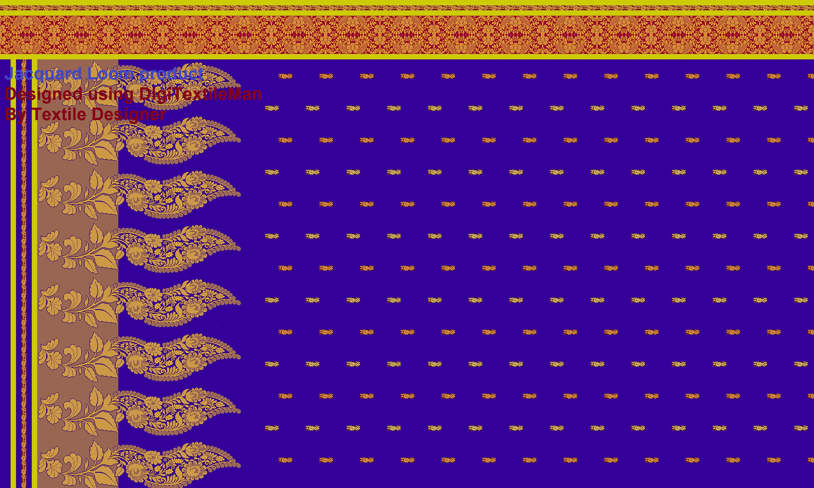

# DigiTextileMan
Standalone desktop application for designing the product of Jacquard Loom Industry. The package contains below three application.

1. DigiTm-MotifCreator: Main application in the package. Early version of this application was developed in 2004 - 2005 which has been redesigned in 2014. The application is used to create motif for jacquard loom product and then compile that motive to generate readable code for punching board and the motif can be saved as 24-bit bitmap image.

2. DigiTm-Designer: This application is used to design jacquard loom product using the motif created in MotifCreator to see how the product will look with combination of different color and motifs.

3. DigiTm-PatternCreator: This is used to create weaving pattern which can be used in MotifCreator and Designer.

## Sample Design

# How to used the application.

1. "Download zip"

2. Go to "Application" directory, you will see three executable.

# Pre-requisite
JDK 1.6.x or later version should be installed in the computer.
  
# Directory structure in the application

1. code: It is storing generated code file for the motif when user click generate code button.

2. init: Application initialization parameters.

3. motif: save motif to library.

4. pattern: save weaving pattern.

Above directory are configurable through application settings.

# Sample 
1. SampleDesign: Sample design created by Textile Designer using designer.

2. SampleMotif: Sample motifs created by Textile designer using MotifCreator.

# Helpful links

1. How application works:
https://youtu.be/zAUxl-XB14Y

2. Sample design: 
https://youtu.be/kgjwaelaBa8

3. Textile manufacture procedure: 
http://youtu.be/vbA8zNfCpGA

